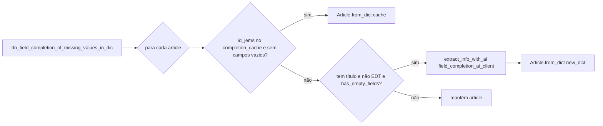
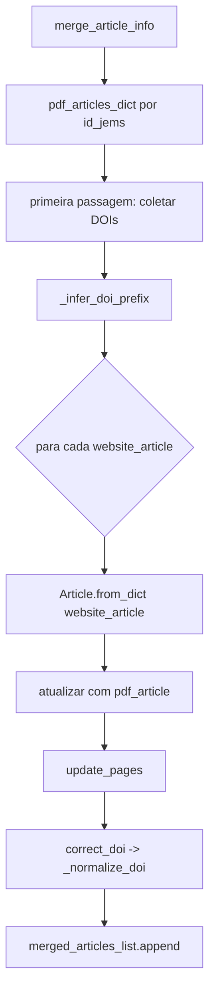
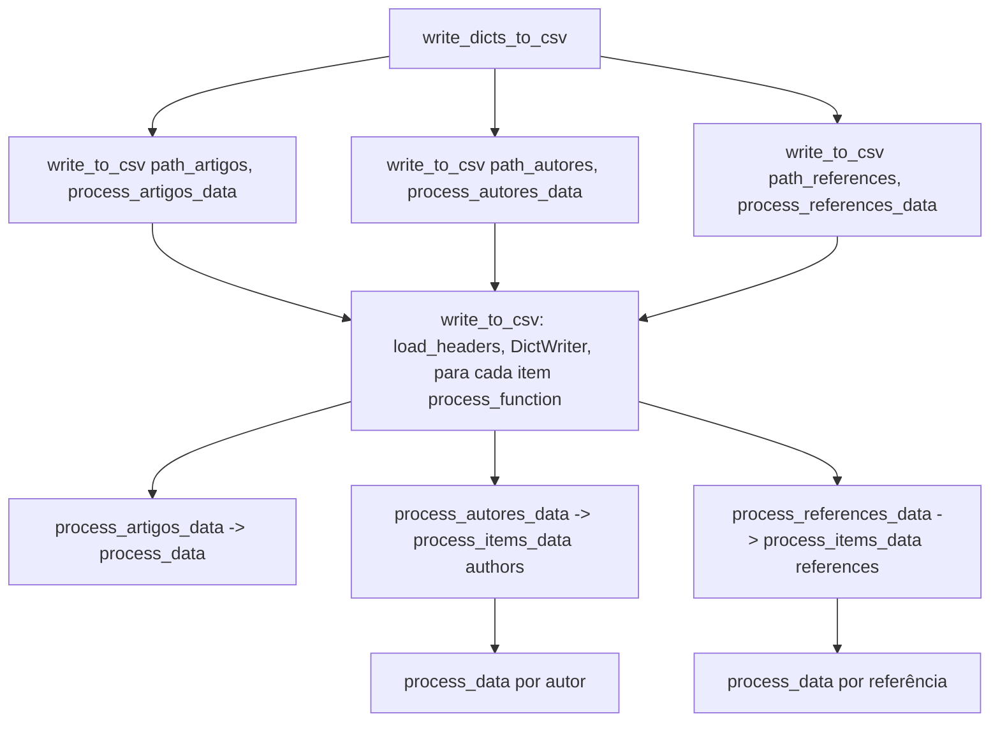

# Diagrama de chamadas – CEIE Proceedings Migration

O projeto **não usa LangGraph**. Usa **LangChain** (ChatOpenAI, ChatAnthropic, etc.) apenas para abstrair chamadas a LLMs (OpenAI, Anthropic, etc.).

Fluxo resumido: `main` → carrega config e clientes de IA → cria `Migrator` → `migrate()` baixa PDFs, extrai metadados (site + PDF + IA), completa campos com IA e grava CSVs.

---

## Diagrama de sequência (chamadas principais)

Cada caixa é um método/função; setas indicam “quem chama quem”.

```mermaid
sequenceDiagram
    participant main as main()
    participant ConfigLoader
    participant JsonLogger
    participant LangChainClient
    participant TextProcessor
    participant ArticleExtractor
    participant Migrator
    participant PDFDownloader
    participant PDFProcessor
    participant OJSHTMLParser
    participant CsvWriter

    main->>ConfigLoader: __init__(filepath)
    ConfigLoader->>ConfigLoader: load_configuration()
    main->>JsonLogger: initialize(config_loader)
    main->>LangChainClient: __init__(x5 clientes)
    LangChainClient->>LangChainClient: _detect_provider(), get_credentials_manager(), initialize_client()
    main->>TextProcessor: __init__(ai_client)
    main->>ArticleExtractor: __init__(ai_clients, text_processor, ...)
    main->>Migrator: __init__(config_loader, article_extractor)
    main->>Migrator: migrate(pages_to_process, files_to_download)

    Migrator->>PDFDownloader: donwload_pdf_files_from_url(num_files)
    PDFDownloader->>PDFDownloader: get_pdf_urls()
    loop por cada PDF
        PDFDownloader->>PDFDownloader: download_and_save_pdf(url)
    end

    Migrator->>Migrator: extract_metadata(num_files, num_pages)
    Migrator->>PDFProcessor: process_all_pdfs(save_files, number_of_pages_to_process)
    loop por cada PDF
        PDFProcessor->>PDFProcessor: extract_text_from_each_page(pdf_path)
    end
    Migrator->>Migrator: _get_website_articles_data(num_files)
    alt cache existe
        Note over Migrator: lê website_articles_cache.json
    else cache não existe
        Migrator->>OJSHTMLParser: extract_articles_info_from_the_website(-1)
        OJSHTMLParser->>OJSHTMLParser: download_html_and_create_parser(site_url)
        OJSHTMLParser->>OJSHTMLParser: _generate_section_abbrev(), _make_abbrev_unique()
        loop por cada artigo no HTML
            OJSHTMLParser->>OJSHTMLParser: get_metadata(metadados_url), convert_url()
        end
    end
    Migrator->>OJSHTMLParser: extract_sections_from_website()
    Migrator->>CsvWriter: write_sections_csv(csv_save_dir, sections_data)
    Migrator->>ArticleExtractor: extract_articles_data_from_PDF_text(all_files_data)
    Migrator->>Migrator: merge_article_info(website_articles_data_list, pdf_articles_list)
    Migrator->>JsonLogger: print_json("articles_metadata_antes_do_field_completion", ...)

    Migrator->>Migrator: complete_missing_fields(articles_list)
    Migrator->>Migrator: _load_completion_cache()
    Migrator->>JsonLogger: read_json_file("articles_metadata_apos_do_field_completion.json")
    Migrator->>ArticleExtractor: do_field_completion_of_missing_values_in_dic(articles_list, completion_cache)
    Migrator->>JsonLogger: print_json("articles_metadata_apos_do_field_completion", ...)
    Migrator->>CsvWriter: __init__(); write_dicts_to_csv(updated_articles)
    Migrator->>Migrator: write_csv_by_workshop(updated_articles)
```

---

## ArticleExtractor – detalhe das chamadas

```mermaid
flowchart TB
    subgraph extract_articles_data_from_PDF_text
        A1[_load_extraction_cache] --> A2{para cada PDF}
        A2 --> A3{cache tem base_filename?}
        A3 -->|sim| A4[Article.from_dict do cache]
        A3 -->|não| A5[extract_article_data]
        A5 --> A6[_save_extraction_cache]
    end

    subgraph extract_article_data
        B1[extract_pages first] --> B2[text_processor.clean_text]
        B2 --> B3[extract_pages last]
        B3 --> B4[text_processor.clean_text]
        B4 --> B5[extract_metadata_with_ai]
        B5 --> B6[Article.from_dict]
    end

    subgraph extract_metadata_with_ai
        C1[extract_article_metadata_with_ai] --> C2[extract_info_with_ai article_ai_client]
        C2 --> C3{sectionAbbrev != EDT?}
        C3 -->|sim| C4[extract_references_metadata_with_ai]
        C4 --> C5[extract_info_with_ai references_ai_client]
        C3 -->|não| C6[references = []]
    end

    subgraph extract_info_with_ai
        D1[ai_client.create_completion] --> D2[_log_ai_call]
        D2 --> D3[parse_ai_response]
        D3 --> D4{JSON ok?}
        D4 -->|não, tentativas < 3| D1
        D4 -->|sim ou falha| D5[retorna dict]
    end

    subgraph TextProcessor.clean_text
        E1[detect_encoding_errors]
        E1 --> E2{erros?}
        E2 -->|sim| E3[process_with_ai -> ai_client.create_completion]
        E2 -->|não| E4[basic_cleaning]
    end
```

---

## do_field_completion (ArticleExtractor)



---

## Migrator.merge_article_info e helpers



---

## CsvWriter.write_dicts_to_csv



---

## Resumo por módulo

| Módulo            | Métodos chamados (principais) |
|-------------------|-------------------------------|
| **main**          | ConfigLoader, JsonLogger.initialize, LangChainClient(x5), TextProcessor, ArticleExtractor, Migrator, migrate() |
| **Migrator**      | downloader.donwload_pdf_files_from_url, extract_metadata, complete_missing_fields, _get_website_articles_data, merge_article_info, _load_completion_cache, write_csv_by_workshop, update_pages, correct_doi, _normalize_doi, _infer_doi_prefix |
| **PDFDownloader** | get_pdf_urls, download_and_save_pdf (requests.get) |
| **PDFProcessor**  | process_all_pdfs, extract_text_from_each_page (fitz) |
| **OJSHTMLParser** | extract_articles_info_from_the_website, download_html_and_create_parser, extract_sections_from_website, get_metadata, convert_url, _generate_section_abbrev, _make_abbrev_unique |
| **ArticleExtractor** | extract_articles_data_from_PDF_text, _load_extraction_cache, extract_article_data, extract_pages, extract_metadata_with_ai, extract_article_metadata_with_ai, extract_references_metadata_with_ai, extract_info_with_ai, do_field_completion_of_missing_values_in_dic, has_empty_fields, parse_ai_response, _log_ai_call, _save_extraction_cache |
| **TextProcessor** | clean_text, detect_encoding_errors, basic_cleaning, process_with_ai |
| **LangChainClient** | _detect_provider, get_credentials_manager, initialize_client (ChatOpenAI/ChatAnthropic), create_completion (invoke messages) |
| **BaseAIClient**  | load_prompt (ConfigLoader), get_credentials().get("api_key"), initialize_client() |
| **ConfigLoader**  | load_configuration, get_config_value, load_prompt |
| **JsonLogger**    | initialize, get_base_dir, _prepare_path, print_json, read_json_file |
| **CsvWriter**     | load_headers, write_to_csv, write_dicts_to_csv, process_artigos_data, process_autores_data, process_references_data, process_data, process_items_data, write_sections_csv |

---

## Observação

**LangGraph** não é usado. O fluxo é procedural: `main` → `Migrator.migrate()` → download → extração (parser + IA) → merge → completion com IA → escrita em CSV. A IA é usada via **LangChain** (ChatOpenAI, ChatAnthropic, etc.) dentro de `LangChainClient.create_completion()`.
