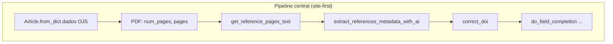
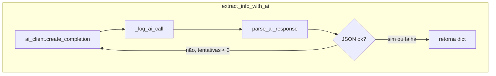
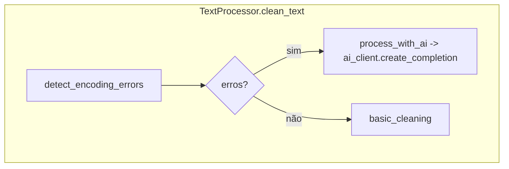
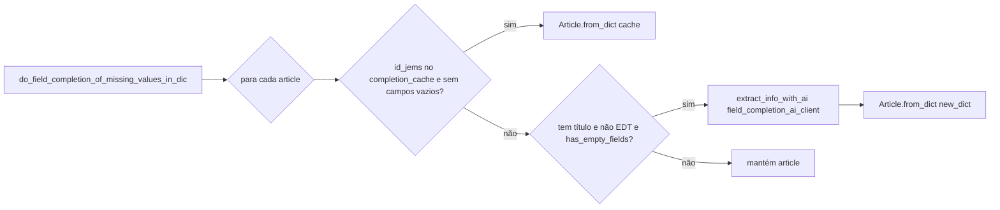
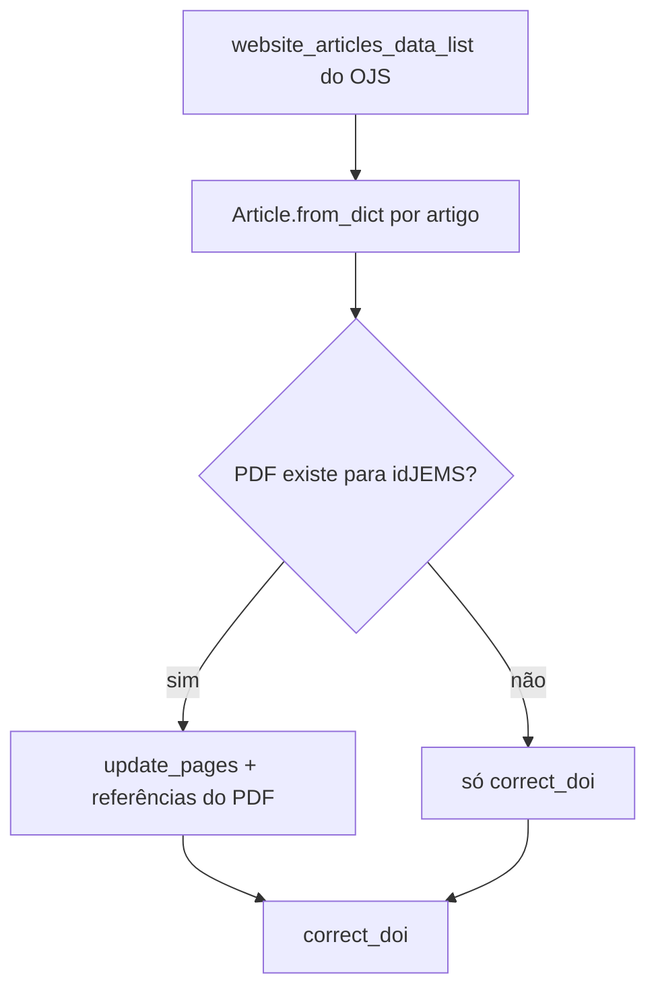
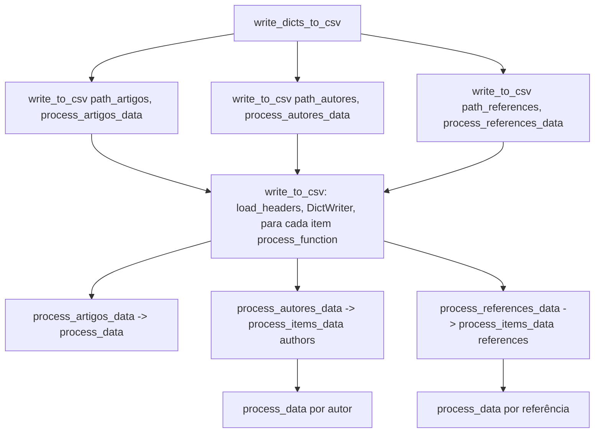

# Diagrama de chamadas – CEIE Proceedings Migration

A **orquestração da migração central** usa **LangGraph** (`src/graphs/migration/`), com estado compartilhado `MigrationState` (Pydantic) passado entre nós. **LangChain** (ChatOpenAI, ChatAnthropic, etc.) abstrai as chamadas a LLMs (OpenAI, Anthropic, etc.).

Fluxo de entrada: `main` → `MigrationGraphService.run()` → grafo compilado (`build_migration_graph.invoke`) → cada nó chama métodos do `Migrator` e demais serviços. A ordem no grafo é linear: `infer_doi_prefix` e `extract_sections` executam **antes** do processamento completo dos PDFs no nó `enrich_from_pdfs`.

Fluxo lógico (site-first): metadados no Milanesa/OJS → **validar o ano** (DOIs) → baixar PDFs → inferir prefixo DOI → **Secoes.csv** → montar `Article` a partir do site → enriquecer com PDF (**páginas + referências**, cache em `references_cache.json`) → field completion → CSVs.

---

## Grafo LangGraph (pipeline central)

Ordem dos nós em `src/graphs/migration/graph.py`:


---

## Diagrama de sequência (chamadas principais)

Cada caixa é um método/função; setas indicam “quem chama quem”. O `Migrator` é usado pelos **nós** do grafo.

```mermaid
sequenceDiagram
    participant main as main()
    participant ConfigLoader
    participant JsonLogger
    participant LangChainClient
    participant TextProcessor
    participant ArticleExtractor
    participant Migrator
    participant GraphSvc as MigrationGraphService
    participant Graph as LangGraph compiled
    participant PDFDownloader
    participant PDFProcessor
    participant OJSHTMLParser
    participant CsvWriter

    main->>ConfigLoader: __init__(filepath)
    ConfigLoader->>ConfigLoader: _load_dotenv(), load_configuration()
    main->>JsonLogger: initialize(config_loader)
    main->>LangChainClient: __init__(x5 clientes)
    LangChainClient->>LangChainClient: _detect_provider(), _initialize_client()
    main->>TextProcessor: __init__(ai_client)
    main->>ArticleExtractor: __init__(ai_clients, text_processor, ...)
    main->>Migrator: __init__(config_loader, article_extractor)
    main->>GraphSvc: MigrationGraphService(config_loader, migrator)
    main->>GraphSvc: run(MigrationGraphInput)
    GraphSvc->>Graph: build_migration_graph(...); invoke(MigrationState)

    Note over Graph,Migrator: Nós do grafo (via nodes.py)

    Graph->>Migrator: _get_website_articles_data(num_files)
    Graph->>Migrator: _validate_year_matches_site_or_abort(website_articles_data_list)

    Graph->>PDFDownloader: donwload_pdf_files_from_url(num_files)
    PDFDownloader->>PDFDownloader: get_pdf_urls()
    loop por cada PDF
        PDFDownloader->>PDFDownloader: download_and_save_pdf(url)
    end

    Graph->>Migrator: _infer_doi_prefix (a partir dos DOIs do site)
    Migrator->>OJSHTMLParser: extract_sections_from_website()
    Migrator->>CsvWriter: write_sections_csv(csv_save_dir, sections_data)

    Graph->>Migrator: Article.from_dict por artigo (build_articles)

    Graph->>PDFProcessor: process_all_pdfs(save_files, number_of_pages_to_process)
    loop por cada PDF
        PDFProcessor->>PDFProcessor: extract_text_from_each_page(pdf_path)
    end

    Note over Graph,Migrator: enrich_from_pdfs: _extract_references_from_pdf_item, references_cache.json

    loop por artigo com PDF correspondente (idJEMS = base_filename)
        Migrator->>Migrator: update_pages(first_page, num_pages)
        Migrator->>ArticleExtractor: get_reference_pages_text(pdf_item, section|last)
        Migrator->>ArticleExtractor: extract_references_metadata_with_ai(texto)
        Migrator->>Migrator: correct_doi(article)
    end

    Migrator->>JsonLogger: print_json("articles_metadata_antes_do_field_completion", ...)

    Graph->>Migrator: finalize_field_completion_outputs(updated_articles)
    Migrator->>Migrator: _load_completion_cache()
    Migrator->>JsonLogger: read_json_file("articles_metadata_apos_do_field_completion.json")
    Migrator->>ArticleExtractor: do_field_completion_of_missing_values_in_dic(articles_list, completion_cache)
    Migrator->>JsonLogger: print_json("articles_metadata_apos_do_field_completion", ...)
    Migrator->>CsvWriter: __init__(); write_dicts_to_csv(updated_articles)
    Migrator->>Migrator: write_csv_by_workshop(updated_articles)
```

---

## ArticleExtractor no pipeline central

O grafo usa principalmente:

- `get_reference_pages_text` + `extract_references_metadata_with_ai` (referências a partir do PDF)
- `extract_pages` (field completion quando o resumo está vazio e precisa de texto das primeiras páginas)
- `do_field_completion_of_missing_values_in_dic` (campos faltantes)



### `extract_info_with_ai`



### TextProcessor.clean_text



---

## do_field_completion (ArticleExtractor)



---

## Migrator: enriquecimento site-first

Metadados vêm do OJS; o PDF complementa páginas e referências.



`_infer_doi_prefix` usa os DOIs já presentes na lista do site (antes do loop de enriquecimento por PDF).

---

## CsvWriter.write_dicts_to_csv



---

## Resumo por módulo

| Módulo            | Métodos chamados (principais) |
|-------------------|-------------------------------|
| **main**          | ConfigLoader, JsonLogger.initialize, LangChainClient(x5), TextProcessor, ArticleExtractor, Migrator, **MigrationGraphService.run(MigrationGraphInput)** |
| **langgraph (graph)** | `build_migration_graph` → nós: fetch_website_articles → validate_year → download_pdfs → infer_doi_prefix → extract_sections → build_articles → enrich_from_pdfs → field_completion_and_write_csvs |
| **MigrationGraphService** | Monta `MigrationState`, chama `graph.invoke(state)`, devolve `MigrationGraphOutput` |
| **Migrator**      | _get_website_articles_data, _validate_year_matches_site_or_abort, downloader.donwload_pdf_files_from_url, _extract_references_from_pdf_item, finalize_field_completion_outputs, _load_completion_cache, write_csv_by_workshop, update_pages, correct_doi, _normalize_doi, _infer_doi_prefix |
| **PDFDownloader** | get_pdf_urls, download_and_save_pdf (requests.get) |
| **PDFProcessor**  | process_all_pdfs, extract_text_from_each_page (fitz) |
| **OJSHTMLParser** | extract_articles_info_from_the_website, download_html_and_create_parser, extract_sections_from_website, get_metadata, convert_url, _generate_section_abbrev, _make_abbrev_unique |
| **ArticleExtractor** | get_reference_pages_text, extract_references_metadata_with_ai, extract_pages, extract_info_with_ai, do_field_completion_of_missing_values_in_dic, has_empty_fields, parse_ai_response, _log_ai_call |
| **TextProcessor** | clean_text, detect_encoding_errors, basic_cleaning, process_with_ai |
| **LangChainClient** | _detect_provider, _initialize_client (ChatOpenAI/ChatAnthropic/…), create_completion (invoke messages); uses ConfigLoader.load_prompt + get_api_key_for_provider |
| **ConfigLoader**  | _load_dotenv, load_configuration, get_config_value, load_prompt, get_api_key_for_provider |
| **JsonLogger**    | initialize, get_base_dir, _prepare_path, print_json, read_json_file |
| **CsvWriter**     | load_headers, write_to_csv, write_dicts_to_csv, process_artigos_data, process_autores_data, process_references_data, process_data, process_items_data, write_sections_csv |

---

## Observação

**LangGraph** orquestra o pipeline central: `main` → `MigrationGraphService` → grafo `invoke` → nós chamam `Migrator` e serviços. A ordem das etapas no grafo é linear (ver seção “Grafo LangGraph”). **LangChain** continua sendo o caminho para chamadas à IA (`LangChainClient.create_completion()`). Ferramentas em `src/tools/` permanecem fora do grafo (scripts à parte).

---

*Última atualização deste diagrama: abril de 2026.*
