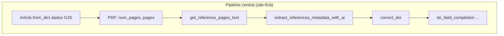
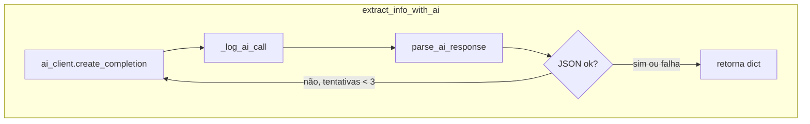
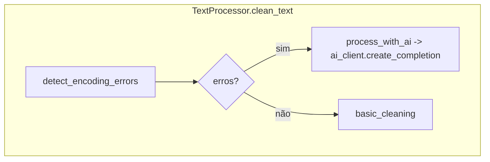
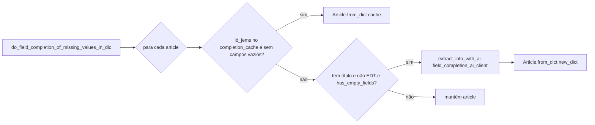
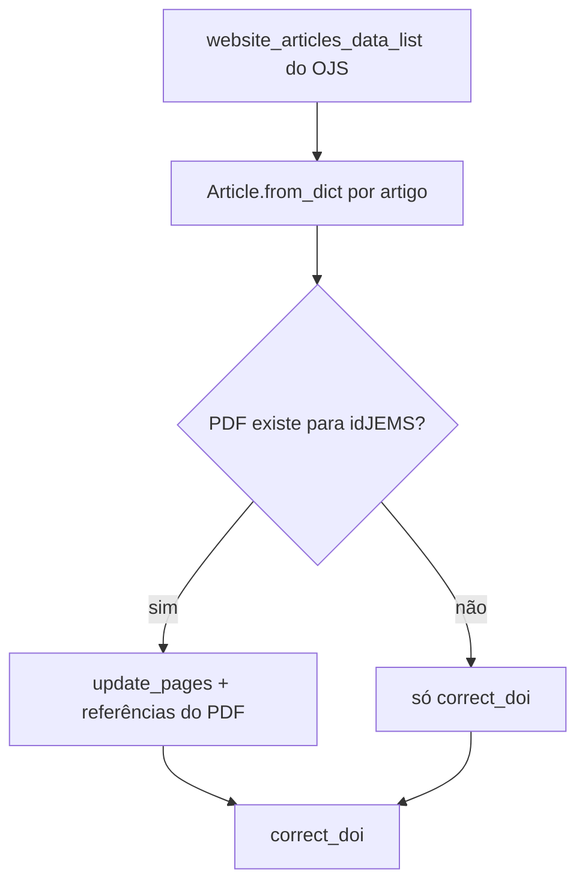
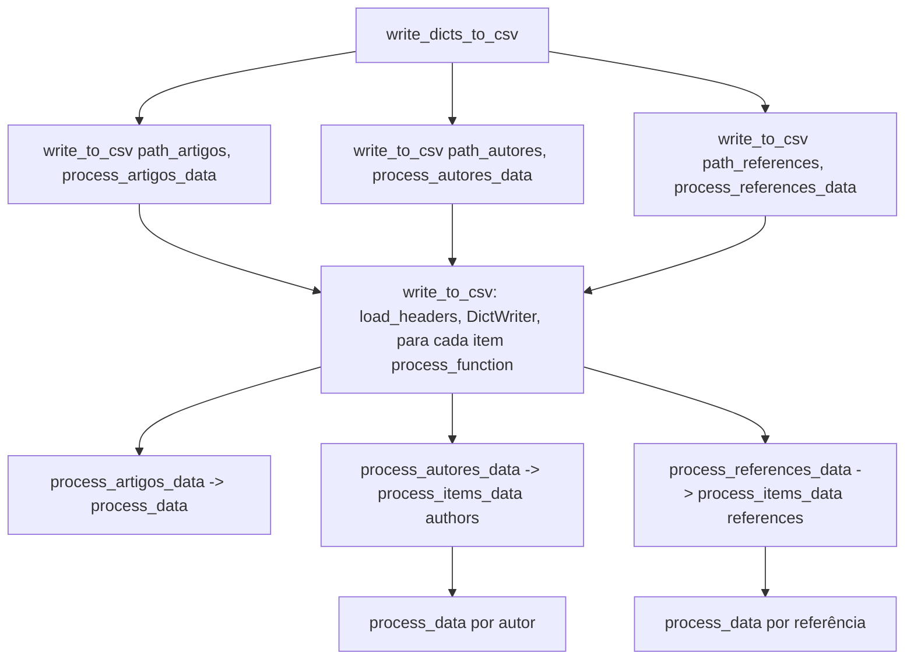

# Diagrama de chamadas – CEIE Proceedings Migration

A **orquestração da migração central** usa **LangGraph** (`src/graphs/migration/`), com estado compartilhado `MigrationState` (Pydantic) passado entre nós. **LangChain** (ChatOpenAI, ChatAnthropic, etc.) abstrai as chamadas a LLMs (OpenAI, Anthropic, etc.).

Fluxo de entrada: `main` → `MigrationGraphService.run()` → grafo compilado (`build_migration_graph.invoke`) → cada nó chama métodos do `Migrator` e demais serviços. Depois de `build_articles`, o grafo passa por `skip_completed_articles` e, em seguida, **enriquecimento por artigo** (`enrich_prepare` → vários `enrich_one_article` via `Send` → `enrich_merge`), depois **field completion** (`field_prepare` → `field_one_article` → `field_merge` → `author_affiliation_email` → `finalize_field_outputs`). Cada PDF é lido com `PDFProcessor.process_pdf_at_path` **só quando o artigo correspondente é tratado** (não há varredura de pasta inteira na pipeline principal).

Fluxo lógico (site-first): metadados no Milanesa/OJS → **validar o ano** (DOIs) → baixar PDFs do lote → inferir prefixo DOI → **Secoes.csv** → montar `Article` → filtrar já completos (opcional) → por artigo do lote: **um PDF** → páginas + referências (cache `references_cache.json` + `_pdf_item_cache` em memória entre enrich e field) → field completion → afiliação/e-mail dos autores (IA, 1ª página) → `articles_metadata_apos_do_field_completion.json` + CSVs.

---

## Grafo LangGraph (pipeline central)

Ordem dos nós em `src/graphs/migration/graph.py`:

```mermaid
flowchart LR
    A[fetch_website_articles] --> B[validate_year]
    B --> C[download_pdfs]
    C --> D[infer_doi_prefix]
    D --> E[extract_sections]
    E --> F[build_articles]
    F --> S[skip_completed_articles]
    S --> P[enrich_prepare]
    P --> O[enrich_one_article]
    O --> M[enrich_merge]
    S -.->|só saltados| M
    M --> FP[field_prepare]
    FP --> FO[field_one_article]
    FO --> FM[field_merge]
    FM --> AA[author_affiliation_email]
    AA --> FF[finalize_field_outputs]
    FF --> Z([Fim])
```



### Sequência de nós — resumo do que cada um faz

Ordem exata em `graph.py`. Os nomes à direita são os identificadores dos nós no grafo.

| Nó | Função (resumo) |
|----|-----------------|
| `fetch_website_articles` | Obtém a lista de artigos do OJS (usa `website_articles_cache.json` quando existe; senão percorre o site e grava cache). |
| `validate_year` | Garante que o ano em `config.json` é consistente com os DOIs dos metadados carregados; interrompe a execução se não for. |
| `download_pdfs` | Descarrega os PDFs do lote configurado para `output/{year}/pdfs/{idJEMS}.pdf`. |
| `infer_doi_prefix` | Calcula o prefixo DOI a partir dos DOIs já presentes na lista do site (quando aplicável). |
| `extract_sections` | Extrai secções do site (OJS) e grava `Secoes.csv`. |
| `build_articles` | Constrói objetos `Article` a partir dos dicts do site, na ordem da edição. |
| `skip_completed_articles` | Opcionalmente remove do lote artigos já “completos” em `articles_metadata_apos_do_field_completion.json`; os saltados são reintroduzidos no `enrich_merge`. |
| `enrich_prepare` | Carrega `references_cache.json` e repõe estado para o map-reduce de enriquecimento. |
| `enrich_one_article` | **Um worker por artigo:** lê o PDF (`PDFProcessor`), atualiza páginas, extrai referências (LLM), `correct_doi`; guarda texto em `_pdf_item_cache`. |
| `enrich_merge` | Ordena os chunks, junta artigos saltados + processados, grava `articles_metadata_antes_do_field_completion.json`. |
| `field_prepare` | Monta excertos brutos das primeiras páginas por `idJEMS` para o field completion (reutiliza cache quando possível); depois limpa `_pdf_item_cache`. |
| `field_one_article` | **Um worker por artigo:** `do_field_completion_of_missing_values_in_dic` (LLM para títulos/resumos/palavras-chave, etc.). |
| `field_merge` | **Reduce:** ordena os chunks do field completion e grava em estado `field_completion_merged_dict_list` (sem LLM de autores e sem gravar ainda o JSON `apos` final). |
| `author_affiliation_email` | Para cada artigo do lote: LLM com prompt `author_affiliation_email_extraction` sobre a 1ª página do PDF (até Resumo/Abstract) — afiliação pt/en, país por extenso, e-mail; **nomes dos autores mantêm-se do Milanesa**. Atualiza `field_completion_merged_dict_list`. |
| `finalize_field_outputs` | `Migrator.finalize_field_completion_outputs`: faz merge com execuções anteriores, grava `articles_metadata_apos_do_field_completion.json`, `Artigos.csv`, `Autores.csv`, `Referencias.csv` e CSVs por workshop. Atualiza `updated_articles_dict_list` no estado. |

**Estado entre `field_merge` e `finalize_field_outputs`:** o campo `MigrationState.field_completion_merged_dict_list` transporta a lista de dicts de artigos já com field completion e, após `author_affiliation_email`, com afiliações/e-mails atualizados — é a entrada de `finalize_field_outputs`.

---

## Diagrama de sequência (chamadas principais)

Cada caixa é um método/função; setas indicam “quem chama quem”. O `Migrator` é usado pelos **nós** do grafo.

```mermaid
sequenceDiagram
    participant main as main()
    participant ConfigLoader
    participant JsonLogger
    participant LangChainClient
    participant TextProcessor
    participant ArticleExtractor
    participant Migrator
    participant GraphSvc as MigrationGraphService
    participant Graph as LangGraph compiled
    participant PDFDownloader
    participant PDFProcessor
    participant OJSHTMLParser
    participant CsvWriter

    main->>ConfigLoader: __init__(filepath)
    ConfigLoader->>ConfigLoader: _load_dotenv(), load_configuration()
    main->>JsonLogger: initialize(config_loader)
    main->>LangChainClient: __init__(x5 clientes)
    LangChainClient->>LangChainClient: _detect_provider(), _initialize_client()
    main->>TextProcessor: __init__(ai_client)
    main->>ArticleExtractor: __init__(ai_clients, text_processor, ...)
    main->>Migrator: __init__(config_loader, article_extractor)
    main->>GraphSvc: MigrationGraphService(config_loader, migrator)
    main->>GraphSvc: run(MigrationGraphInput)
    GraphSvc->>Graph: build_migration_graph(...); invoke(MigrationState)

    Note over Graph,Migrator: Nós do grafo (via nodes.py)

    Graph->>Migrator: _get_website_articles_data(num_files)
    Graph->>Migrator: _validate_year_matches_site_or_abort(website_articles_data_list)

    Graph->>PDFDownloader: donwload_pdf_files_from_url(num_files)
    PDFDownloader->>PDFDownloader: get_pdf_urls()
    loop por cada PDF
        PDFDownloader->>PDFDownloader: download_and_save_pdf(url)
    end

    Graph->>Migrator: _infer_doi_prefix (a partir dos DOIs do site)
    Migrator->>OJSHTMLParser: extract_sections_from_website()
    Migrator->>CsvWriter: write_sections_csv(csv_save_dir, sections_data)

    Graph->>Migrator: Article.from_dict por artigo (build_articles)
    Graph->>Migrator: skip_completed_articles (cache após field completion)

    Note over Graph,Migrator: enrich_prepare: _refs_cache; limpa _pdf_item_cache

    loop por artigo do lote (Send → enrich_one_article)
        PDFProcessor->>PDFProcessor: process_pdf_at_path(pdf_path, pages_to_process)
        Migrator->>Migrator: _pdf_item_cache[idJEMS] = pdf_item
        Migrator->>Migrator: update_pages, _extract_references_from_pdf_item
        Migrator->>ArticleExtractor: get_reference_pages_text(pdf_item, section|last)
        Migrator->>ArticleExtractor: extract_references_metadata_with_ai(texto)
        Migrator->>Migrator: correct_doi(article)
    end

    Migrator->>JsonLogger: print_json("articles_metadata_antes_do_field_completion", ...)

    Note over Graph,Migrator: field_prepare: _build_pdf_raw_by_id (reusa _pdf_item_cache; depois clear)

    loop por artigo (Send → field_one_article)
        Migrator->>ArticleExtractor: do_field_completion_of_missing_values_in_dic(...)
    end

    Note over Graph,Migrator: field_merge: ordena chunks → field_completion_merged_dict_list

    loop por artigo do lote (nó author_affiliation_email)
        Migrator->>Migrator: enrich_article_authors_affiliation_email_with_llm (PDF + LLM)
    end

    Note over Graph,Migrator: finalize_field_outputs: merge com apos anterior + disco

    Graph->>Migrator: finalize_field_completion_outputs(updated_articles)
    Migrator->>Migrator: _load_articles_metadata_apos_dicts(); _merge_articles_for_full_output
    Migrator->>JsonLogger: print_json("articles_metadata_apos_do_field_completion", ...)
    Migrator->>CsvWriter: write_dicts_to_csv(merged_articles)
    Migrator->>Migrator: write_csv_by_workshop(merged_articles)
```

---

## ArticleExtractor no pipeline central

O grafo usa principalmente:

- `get_reference_pages_text` + `extract_references_metadata_with_ai` (referências a partir do PDF)
- `extract_pages` (field completion quando o resumo está vazio e precisa de texto das primeiras páginas)
- `do_field_completion_of_missing_values_in_dic` (campos faltantes)



### `extract_info_with_ai`



### TextProcessor.clean_text



---

## do_field_completion (ArticleExtractor)



---

## Migrator: enriquecimento site-first

Metadados vêm do OJS (incluindo idioma na `rt/metadata` quando a tabela expõe o campo); o PDF complementa páginas e referências.



`_infer_doi_prefix` usa os DOIs já presentes na lista do site (antes do loop de enriquecimento por PDF).

---

## CsvWriter.write_dicts_to_csv



---

## Resumo por módulo

| Módulo            | Métodos chamados (principais) |
|-------------------|-------------------------------|
| **main**          | ConfigLoader, JsonLogger.initialize, LangChainClient(x5), TextProcessor, ArticleExtractor, Migrator, **MigrationGraphService.run(MigrationGraphInput)** |
| **langgraph (graph)** | `build_migration_graph` → fetch_website_articles → validate_year → download_pdfs → infer_doi_prefix → extract_sections → build_articles → skip_completed_articles → enrich_prepare → enrich_one_article (×N) → enrich_merge → field_prepare → field_one_article (×N) → field_merge → **author_affiliation_email** → **finalize_field_outputs** |
| **MigrationGraphService** | Monta `MigrationState`, chama `graph.invoke(state)`, devolve `MigrationGraphOutput` |
| **Migrator**      | _get_website_articles_data, _validate_year_matches_site_or_abort, downloader, _extract_references_from_pdf_item, _build_pdf_raw_by_id, _pdf_item_cache, **enrich_article_authors_affiliation_email_with_llm**, finalize_field_completion_outputs, _load_completion_cache, _merge_articles_for_full_output, write_csv_by_workshop, update_pages, correct_doi, _infer_doi_prefix |
| **PDFDownloader** | get_pdf_urls, download_and_save_pdf (requests.get) |
| **PDFProcessor**  | `extract_text_from_each_page`, `process_pdf_at_path` (um ficheiro por chamada; sem `process_all_pdfs`) |
| **OJSHTMLParser** | extract_articles_info_from_the_website, download_html_and_create_parser, extract_sections_from_website, get_metadata, _metadata_table_field, _normalize_language_from_metadata, convert_url, _generate_section_abbrev, _make_abbrev_unique |
| **ArticleExtractor** | get_reference_pages_text, extract_references_metadata_with_ai, extract_pages, extract_info_with_ai, do_field_completion_of_missing_values_in_dic, has_empty_fields, parse_ai_response, _log_ai_call |
| **TextProcessor** | clean_text, detect_encoding_errors, basic_cleaning, process_with_ai |
| **LangChainClient** | _detect_provider, _initialize_client (ChatOpenAI/ChatAnthropic/…), create_completion (invoke messages); uses ConfigLoader.load_prompt + get_api_key_for_provider |
| **ConfigLoader**  | _load_dotenv, load_configuration, get_config_value, load_prompt, get_api_key_for_provider |
| **JsonLogger**    | initialize, get_base_dir, _prepare_path, print_json, read_json_file |
| **CsvWriter**     | load_headers, write_to_csv, write_dicts_to_csv, process_artigos_data, process_autores_data, process_references_data, process_data, process_items_data, write_sections_csv |

---

## Observação

**LangGraph** orquestra o pipeline central: `main` → `MigrationGraphService` → grafo `invoke` → nós chamam `Migrator` e serviços. Há ramificações condicionais (`skip_completed_articles`, `route_enrich_articles`, `route_field_completion`) e **map-reduce** com `Send` para `enrich_one_article` e `field_one_article`. Depois do `field_merge` seguem **dois nós sequenciais**: `author_affiliation_email` (LLM afiliação/e-mail no PDF) e `finalize_field_outputs` (JSON `apos` + CSVs). O parâmetro `max_concurrency` no `invoke` limita o paralelismo (ex.: `1` = sequencial). **LangChain** continua sendo o caminho para chamadas à IA (`LangChainClient.create_completion()`). Ferramentas em `src/tools/` permanecem fora do grafo (scripts à parte).

---

*Última atualização deste diagrama: abril de 2026.*
